# 搭建微信机器人

### 注册 AI 模型

1、进入智普 AI：https://open.bigmodel.cn/，进行注册、登录和认证

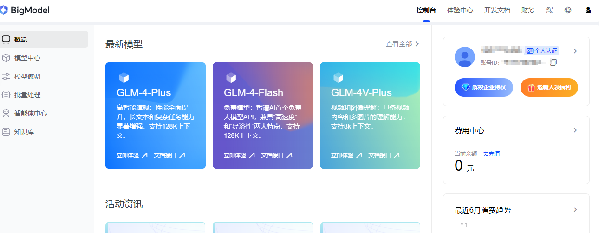

2、点击添加新的 API key ，再点击复制，后续项目会用上。

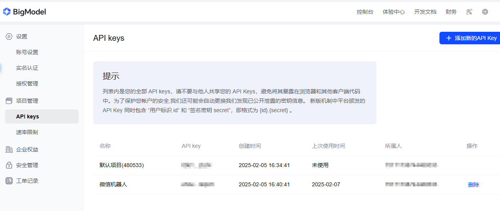

### 部署服务

1、注册购买阿里云服务器，新用户有试用，具体不过述。

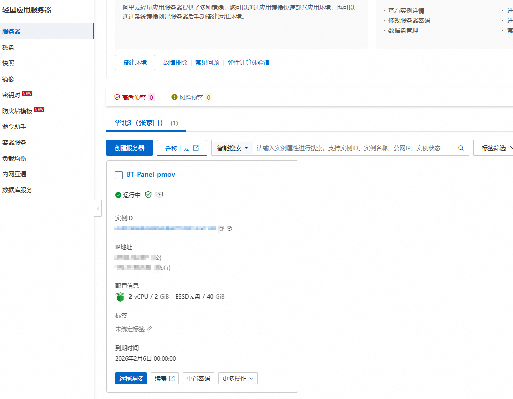

2、克隆chatgpt-on-wechat项目到自己的服务器

```
git clone https://github.com/zhayujie/chatgpt-on-wechat
```

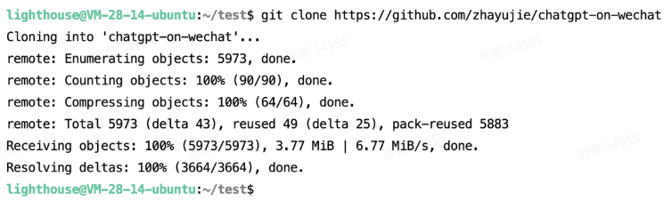

3、安装依赖

```
cd chatgpt-on-wechat/
pip install -r requirements.txt
```

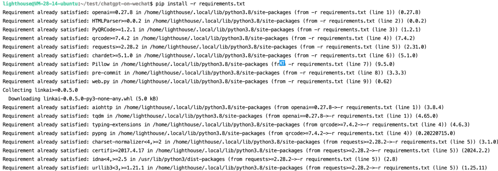

```
pip install -r requirements-optional.txt
```

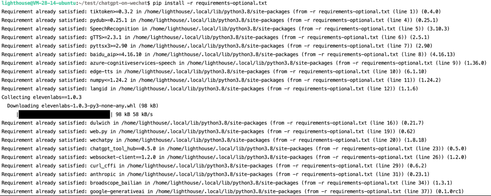

```
pip3 install zhipuai
```

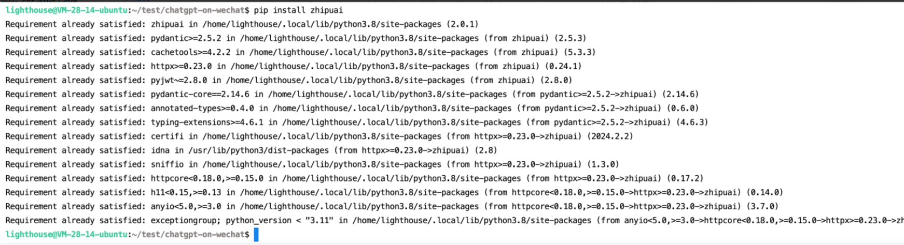

4、服务端配置

复制配置文件模板

```
cp config-template.json config.json
```

修改配置

```
vi config.json
```

需要注册微信公众号，在微信公众后台系统获取对应的信息

```
{
  "channel_type": "wechatmp", // 公众号
  "model": "glm-4",
  "zhipu_ai_api_key": "在智谱复制的key",
  "zhipu_ai_api_base": "https://open.bigmodel.cn/api/paas/v4",
  "text_to_image": "dall-e-2",
  "voice_to_text": "openai",
  "text_to_voice": "openai",
  "proxy": "",
  "hot_reload": false,
  "single_chat_prefix": [""],
  "single_chat_reply_prefix": "",
  "group_chat_prefix": [
    "@AI智能助手"
  ],
  "group_name_white_list": [
    "ALL_GROUP"
  ],
  "image_create_prefix": [
    "画"
  ],
  "speech_recognition": true,
  "group_speech_recognition": false,
  "voice_reply_voice": false,
  "conversation_max_tokens": 2500,
  "expires_in_seconds": 3600,
  "character_desc": "你是一个微信机器人, 你旨在回答并解决人们的任何问题，并且可以使用多种语言与人交流。",
  "temperature": 0.7,
  "subscribe_msg": "感谢您的关注！\n这里是AI智能助手，可以自由对话。\n支持语音对话。\n支持图片输入。\n支持图片输出，画字开头的消息将按要求创作图片。\n支持tool、角色扮演和文字冒险等丰富的插件。\n输入{trigger_prefix}#help 查看详细指令。
",
  "use_linkai": false,
  "linkai_api_key": "",
  "linkai_app_code": "",
  "wechatmp_app_id": "公众号后台的开发者ID(AppID)",
  "wechatmp_app_secret": "公众号后台的开发者密码(AppSecret)",
  "wechatmp_aes_key": "公众号后台配置的key，仅安全模式下用到",
  "wechatmp_token": "公众号后台配置的token，仅安全模式下用到",
  "wechatmp_port": 80
}
```

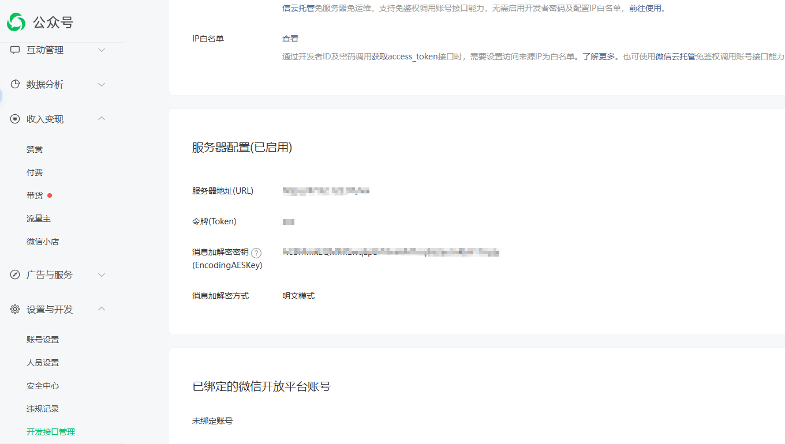

复制另一个配置文件

```
cd plugins/godcmd
cp config.json.template config.json
```

输入以下命令修改这个 config.json； 设置下你的 password 和 admin_users

```
vi config.json
```

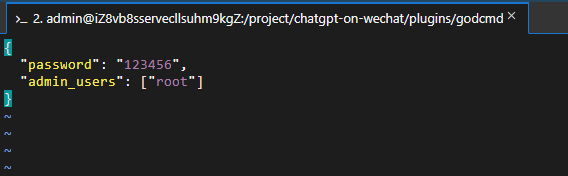

重新回到 chatgpt-on-wechat/这个目录下

```
cd ~/chatgpt-on-wechat/
```

然后创建日志文件并启动服务：

```
touch nohup.out
nohup python3 app.py & tail -f nohup.out
```

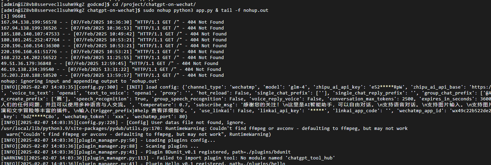

### 测试验证

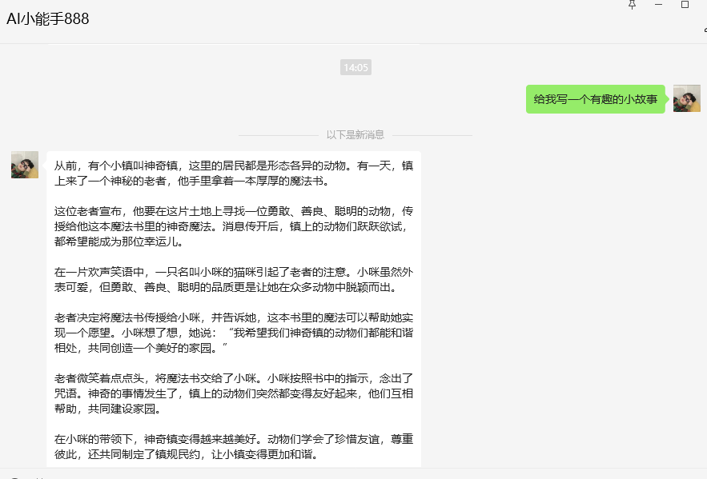
