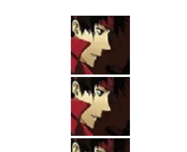

块级元素包含内联元素如图片文字等时，内联元素默认是和父级元素的baseline（基线）对齐的，而baseline又和父级元素底边有一定的距离（这个距离和font有关，不一定是5px），所以不同div之间有间隙，这是因为图片与父元素的底边有距离。

1、将图片转换为块级对像
因为存在间隙的主要问题出现在行内块元素上，即设置img为：
display：block；

2、设置图片的垂直对齐方式
即设置图片的vertical-align属性为top |middle |bottom 也可以解决。如本例中增加一组CSS代码：

 #sub img {vertical-align:top;}
3、设置父对象的文字大小为0px
即，在父元素中添加一行： font-size:0;

可以解决问题。但这也引发了新的问题，在父对像中的文字都无法显示。就算文字部分被子对像括起来，设置子对像文字大小依然可以显示，但在CSS效验的时候会提示文字过小的错误。（不建议使用）

4、改变父对象的属性
如果父对象的宽、高固定，图片大小随父对像而定，那么可以设置： overflow:hidden; 来解决。

如本例中可以向#sub中添加以下代码：

width:88px;height:31px;overflow:hidden;

5、设置图片的浮动属性
即在本例中增加一行CSS代码：#sub img {float:left;}

如果要实现图文混排，这种方法是很好的选择。