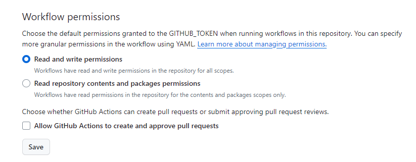
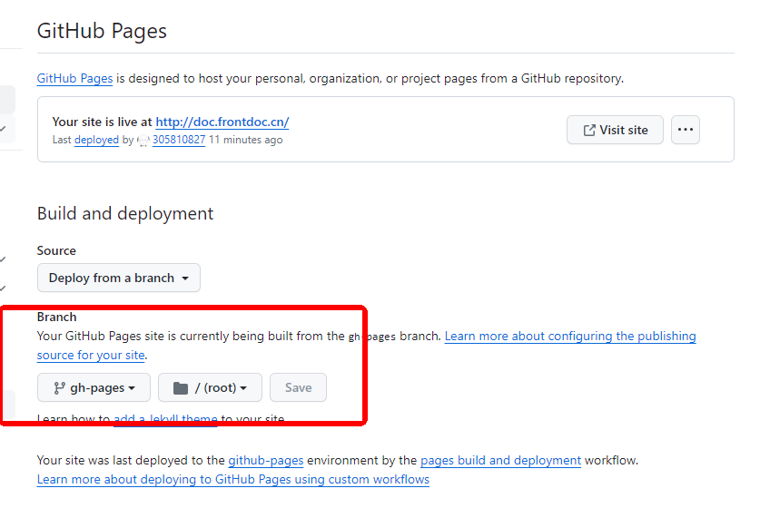

## 一、git push自动部署

##### 1、创建用于工作流的文件

在项目根目录下创建一个用于 GitHub Actions 的工作流 `.yml` 文件

```
name: docs

on:
  # 每当 push 到 main 分支时触发部署
  push:
    branches: [main]
  # 手动触发部署
  workflow_dispatch:

jobs:
  docs:
    runs-on: ubuntu-latest

    steps:
      - uses: actions/checkout@v4
        with:
          # “最近更新时间” 等 git 日志相关信息，需要拉取全部提交记录
          fetch-depth: 0

      - name: Setup pnpm
        uses: pnpm/action-setup@v2
        with:
          # 选择要使用的 pnpm 版本
          version: 8
          # 使用 pnpm 安装依赖
          run_install: true

      - name: Setup Node.js
        uses: actions/setup-node@v4
        with:
          # 选择要使用的 node 版本
          node-version: 18
          # 缓存 pnpm 依赖
          cache: pnpm

      # 运行构建脚本
      - name: Build VuePress site
        run: pnpm docs:build

      # 查看 workflow 的文档来获取更多信息
      # @see https://github.com/crazy-max/ghaction-github-pages
      - name: Deploy to GitHub Pages
        uses: crazy-max/ghaction-github-pages@v4
        with:
          # 部署到 gh-pages 分支
          target_branch: gh-pages
          # 部署目录为 VuePress 的默认输出目录
          build_dir: docs/.vuepress/dist
        env:
          # @see https://docs.github.com/cn/actions/reference/authentication-in-a-workflow#about-the-github_token-secret
          GITHUB_TOKEN: ${{ secrets.GITHUB_TOKEN }}
```

##### 2、开放当前仓库的读写权限

因为每个 GitHub 仓库都默认只让 GitHub Actions 读取仓库内容，不允许读写，因此需为 GitHub Actions 开放当前仓库的读写权限，否则无法正常构建 GitHub Pages

点击仓库选项卡 Settings→Actions→General，在 Workflow permissions中选择读写权限 Read and write permissions后，点击保存即可



执行 `git push` 就会自动触发工作流

##### 3、设置部署分支

将vuepress构建后的 `src/.vuepress/dist/` 目录 push 到 GitHub 仓库中的 `gh-pages` 分支（本地仓库没有该分支）

点击仓库选项卡 `Settings`-`Pages` 后，进行如下操作：




## 二、执行脚本部署

##### 1、项目根目录下新建deploy.sh脚本

```
#!/usr/bin/env sh

# 确保脚本抛出遇到的错误
set -e

# 生成静态文件
npm run build

# 进入生成的文件夹
cd docs/.vuepress/dist

# 如果是发布到自定义域名
 echo 'doc.frontdoc.cn' > CNAME

git init
git add -A
git commit -m 'deploy'

# 如果发布到 https://<USERNAME>.github.io
# git push -f git@github.com:<USERNAME>/<USERNAME>.github.io.git master

# 如果发布到 https://<USERNAME>.github.io/<REPO>
git push -f git@github.com:305810827/myDocs.git master:gh-pages

cd -
```

```sh
#打开gitbash执行部署脚本
./deploy.sh
```

这样每次执行deploy脚本后，github的Actions会自动执行部署工作流，页面就会自动更新.

## 三、自定义域名

自定义域名需要在自己的域名上添加解析


