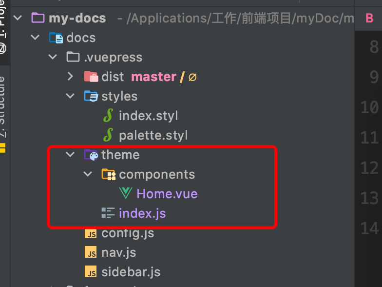

# vuepress自定义theme

#### 一、首页添加备案号及链接至工信部首页。（工信部链接https://beian.miit.gov.cn/）

1、在.vuepress/theme/下创建一个index.js文件（目录自行创建）




```
module.exports = {
  extend: '@vuepress/theme-default'
}
```


2、在.vuepress/theme/components/创建一个Home.vue, 可以自定义vuepress的主页样式，也可以复制vuepress的默认样式进行修改，我修改了两处，让我在README.md配置footer时，可以写html标签。


3、修改README.md 的footer


同样的方法可以修改其他默认的组件


4、如果组件有插槽，可以直接使用插槽

`.vuepress/theme/layouts/Layout.vue`

```
<template>
  <ParentLayout>
    <template #page-bottom>
      <div>My custom footer</div>
    </template>
  </ParentLayout>
</template>

<script>
import ParentLayout from '@parent-theme/layouts/Layout.vue'

export default {
  name: 'Layout',

  components: {
    ParentLayout
  }
}
</script>
```

