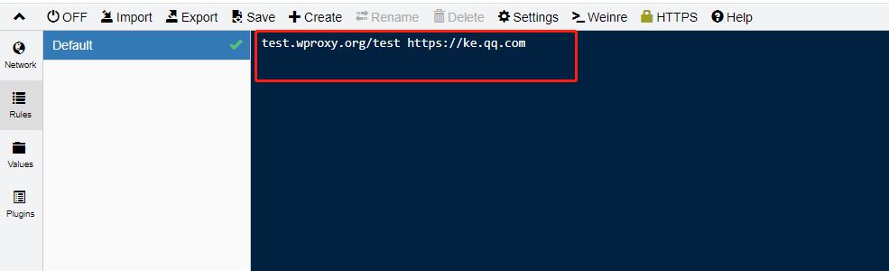
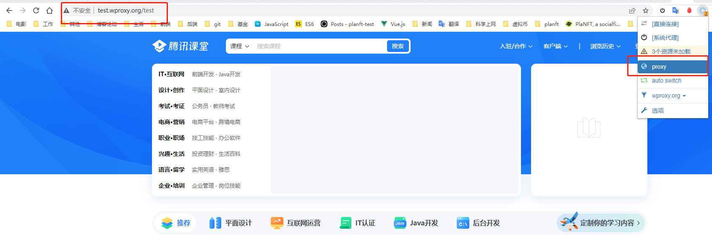
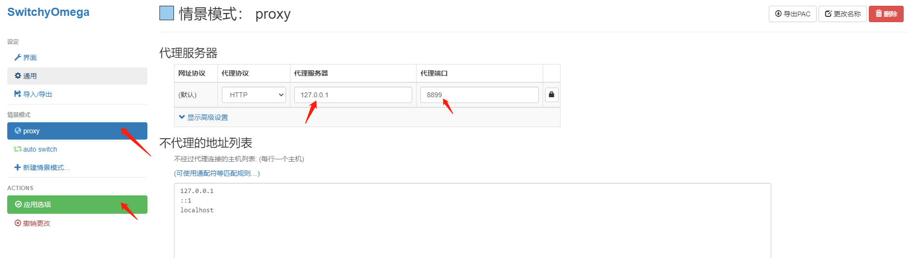
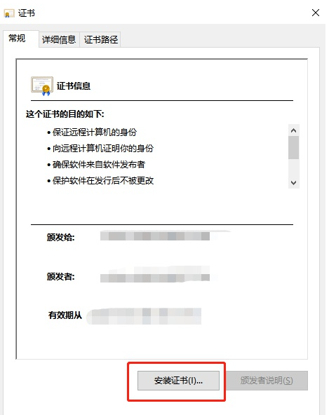
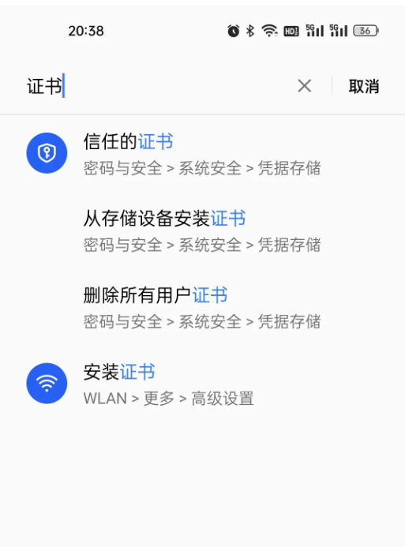
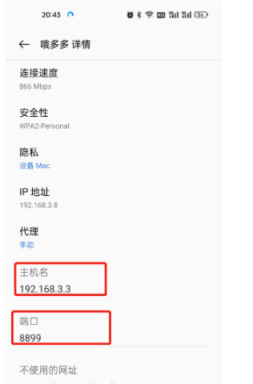
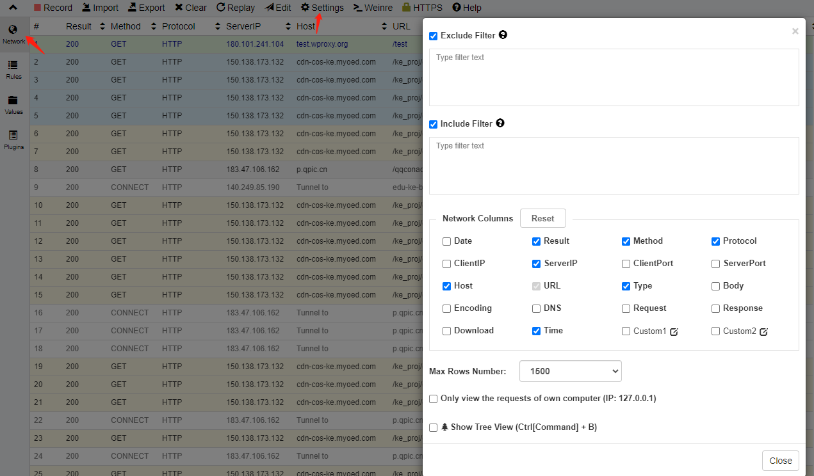

### 1、whistle介绍

- *[whistle官网](https://link.zhihu.com/?target=https%3A//wproxy.org/whistle/)*
- *[whistle github](https://link.zhihu.com/?target=https%3A//gitcode.net/mirrors/avwo/whistle%3Futm_source%3Dcsdn_github_accelerator)*
- whistle主要用于查看、修改HTTP、HTTPS、Websocket的请求、响应，也可以作为HTTP代理服务器，功能很强大

### 2、安装教程

- *[官方安装文档](https://link.zhihu.com/?target=https%3A//wproxy.org/whistle/install.html)*


```
// 全局安装whistle
npm install -g whistle

// 安装whistle的inspect插件，用于在网页中注入vConsole调试工具，方便调试手机上的h5页面
npm i -g whistle.inspect
```

- 常用命令：

w2 start // 启动

w2 stop // 关闭

whistle启动后，即可在浏览器内访问whistle页面：[http://127.0.0.1:8899](https://link.zhihu.com/?target=http%3A//127.0.0.1%3A8899/)，打开可以按照规则配置代理的url





### 3、浏览器设置

- 下载 Chrome 代理插件：推荐安装 SwitchyOmega
- 点击设置，配置对应的代理服务器



至此，我们已经能够基本完成whistle和SwitchyOmega的代理

### 4、安装证书，htts代理

- [官方安装证书教程](https://link.zhihu.com/?target=http%3A//wproxy.org/whistle/webui/https.html)
- 访问http://localhost:8899/

PC下载完成后，双击傻瓜式安装即可



手机端下载证书后，在设置找到“从存储设备安装证书”类似的选项添加证书



最后，在我们手机和电脑连接同一个wifi或者网络下，手机上设置ip地址和端口，ip地址可以通过ipconfig获取



访问http://localhost:8899/network/，可以查看抓包，由于会产生大量的请求，所以必须在setting中设置过滤条件，如下：

