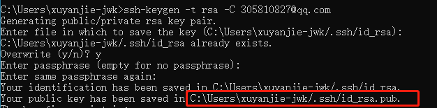
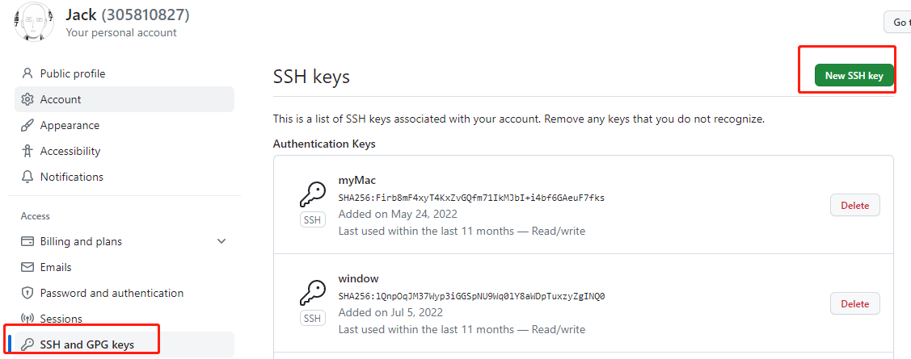
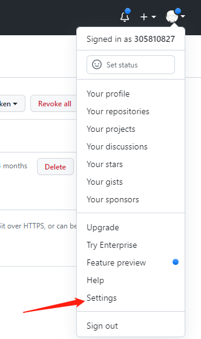
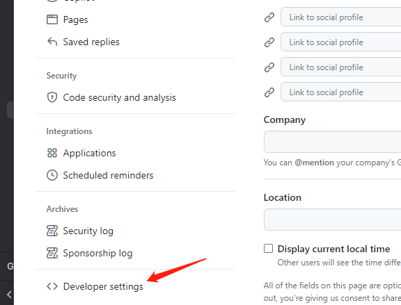
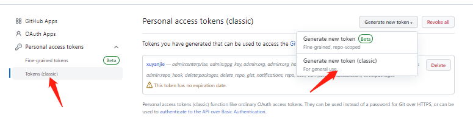
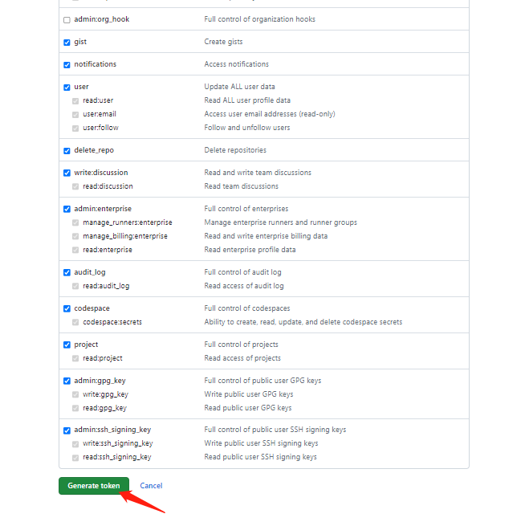

# 生成ssh和git token

### 一、生成ssh

在cmd输入命令行：ssh-keygen -t rsa -C "你的邮箱"，输入后一路回车即可,即会生成你的ssh key。

找到划红线的目录，打开文件并复制内容。添加到自己git中的SSH and GPG keys中

### 一、git token

1、点击你的GitHub头像，选择下拉框中的“settings”:

2、选择左侧菜单的“Developer settings”一项：

3、选择“tokens(classic)”、点击“Generate new token”:

4、按自己需求选择，然后便可生成一个token：

