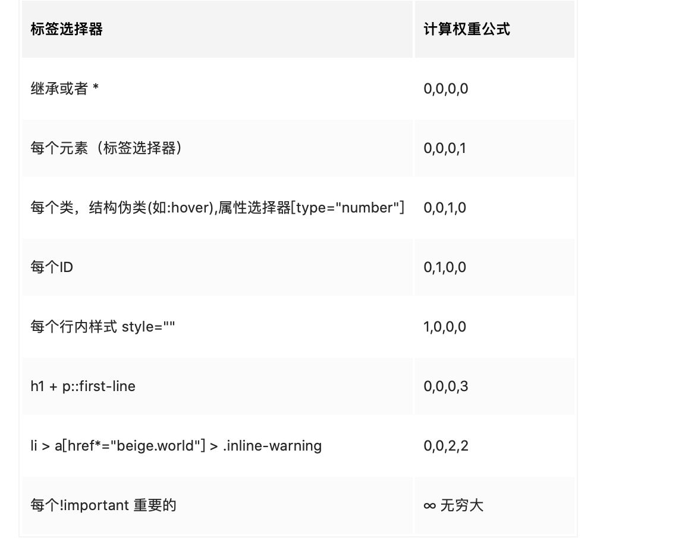

### css 三大特性

#### 1、层叠性：css样式冲突采取原则（后者覆盖前者）


#### 2、继承性：对于部分属性样式会有天生的继承

　　（1）字体系列属性

　　font-family：字体系列

　　font-weight：字体的粗细

　　font-size：字体的大小

　　font-style：字体的风格

 

　　（2）文本系列属性

　　text-indent：文本缩进

　　text-align：文本水平对齐

　　line-height：行高

　　word-spacing：单词之间的间距

　　letter-spacing：中文或者字母之间的间距

　　text-transform：控制文本大小写（就是uppercase、lowercase、capitalize这三个）

　　color：文本颜色

 

　　（3）元素可见性：

　　visibility：控制元素显示隐藏

 

　　（4）列表布局属性：

　　list-style：列表风格，包括list-style-type、list-style-image等

 

　　（5）光标属性：

　　cursor：光标显示为何种形态


##### 控制继承的四个属性

- `inherit`: 被应用属性继承父级的该属性（默认就是该值）
- `initial`初始化，把应用属性初始为它默认的样式，并且排除继承的干扰（默认会继承的属性也不在默认继承，而是表现出没有任何设置时候的默认样式）
- `unset`：意思是恢复其原本的继承方式。对`color`属性而言，就相当于`inherit`；而对于诸如`border`这样默认不继承的属性，就相当于`initial`。
- `revert`: 效果等同于`unset`且浏览器支持有限


#### 3、优先性：选择器优先级算法



**值从左到右，左面的最大，一级大于一级，数位之间没有进制，级别之间不可超越。**

- div ul li ------> 0,0,0,3
- .nav ul li ------> 0,0,1,2
- a:hover -----—> 0,0,1,1
- .nav a ------> 0,0,1,1

**important适用优先级**💡

```css
#id div.box div {
    color: green !important; // 使用这个选择器中的颜色
}

#id .box div {
    color: red !important;
}
```


#####  /deep/深度作用选择器

vue当 `<style>` 标签有 `scoped` 属性时，它的 CSS 只作用于当前组件中的元素。

它通过使用 PostCSS 来实现以下转换：

```html
<style scoped>
.example {
  color: red;
}
</style>

<template>
  <div class="example">hi</div>
</template>
```

转换结果：

```html
<style>
.example[data-v-f3f3eg9] {
  color: red;
}
</style>

<template>
  <div class="example" data-v-f3f3eg9>hi</div>
</template>
```

使用 `scoped` 后，父组件的样式将不会渗透到子组件中。不过一个子组件的根节点会同时受其父组件的 scoped CSS 和子组件的 scoped CSS 的影响。这样设计是为了让父组件可以从布局的角度出发，调整其子组件根元素的样式。


如果你希望 `scoped` 样式中的一个选择器能够作用得“更深”，例如影响子组件，你可以使用 `>>>` 操作符：

```html
<style scoped>
.a >>> .b { /* ... */ }
</style>
```

上述代码将会编译成：

```css
.a[data-v-f3f3eg9] .b { /* ... */ }
```


通过 `v-html` 创建的 DOM 动态生成的内容不受 scoped 样式影响，但是你仍然可以通过深度作用选择器来为他们设置样式


想要覆盖组件库组件样式，实现我们自己的样式时，可以使用/deep/深度作用选择器
