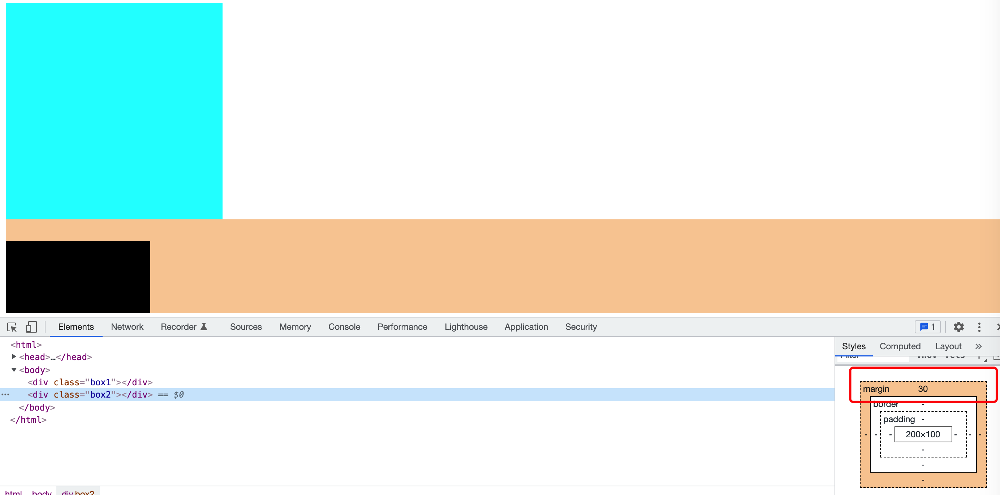

### margin合并

普通文档流中块级元素的垂直外边距会互相合并，以他们之间外边距大的为准。



```
<html>
    <head>
        <style>
            /* 定位 + margin-top + margin-left */
            .box1{
                width: 300px;
                height: 300px;
                background-color: aqua;
                margin-bottom: 20px;
            }
            .box2 {
                width: 200px; 
                height: 100px;
                background-color: black;
                margin-top: 30px;
            }
        </style>
    </head>
    <body>
            <div class="box1"></div>
            <div class="box2"></div>
    </body>
</html>
```

解决：

1、设置一方的外边距为两者原来预设外边距之和

2、设置元素BFC

### margin 塌陷

普通文档流中父子块级元素，如果父元素没有设置上内边距或上边框，子元素的上边距就会和父元素的上边距重合，以他们两个中间最大上边距为准，与距离他们最近的盒子隔开。


```javascript
<html>
    <head>
        <style>
            /* 定位 + margin-top + margin-left */
            .box1{
                width: 300px;
                height: 300px;
                background-color: aqua;
                margin-bottom: 10px;
            }
            .box2 {
                width: 200px; 
                height: 100px;
                background-color: black;
                margin-top: 50px;
            }
        </style>
    </head>
    <body>
        <div class="box1">
            <div class="box2"></div>
        </div>
    </body>
</html>
```

解决：

1、设置父元素BFC，display 为inline-blocks