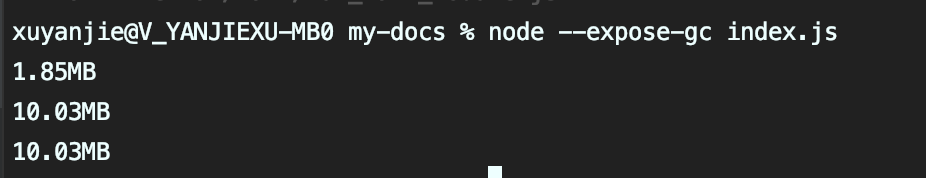

### Map

map是一个键名和键值可以是任意类型的键值对集合，它按照键值对的插入顺序来排列，如果给同一个键名插入键值，后者会覆盖前者

```javascript
let map = new Map()
map.set(1, 1)
map.set('string', 'string')
map.set({'1': '1'}, {'1': '1'})
console.log(map)
```


可以通过给Map构造函数传入一个二位数组作为键值对集合初始化一个map结构的变量

```javascript
let map = new Map([[1,2],[3,4]])
```

### Map的属性和方法

```javascript
let map = new Map([[1,2],[3,4]])
map.set('1',2)
map.get('1')
map.size
map.delete('1')
map.entries()
map.has(1)
map.keys()
map.values()
map.clear()
```

### WeakMap

weakMap是一个键名只能为对象引用的键值对集合，键名对象的引用也只是弱引用，若外部没有这个对象的强引用，那么这个对象随时有可能会被垃圾回收，所以weakMap不可枚举，不可清空，也没有size属性。


### node执行查看内存变化

```javascript
function formatByte(bytes) {
  return (bytes/1024/1024).toFixed(2) + 'MB'
}

function print () {
  global.gc()
  let memoryUsage = process.memoryUsage()
  console.log(formatByte(memoryUsage.heapUsed));
}

let map = new Map()
print()
let arr = new Array(1024*1024)
map.set(arr, '1')
print()
arr = null
print()
```

global.gc()会执行一次垃圾回收，需要在使用node命令是加上--expose-gc参数



```javascript
let weakMap = new WeakMap()
print()
let arr = new Array(1024*1024)
weakMap.set(arr, '1')
print()
arr = null
print()
```


### set

不重复的类数组集合，成员可以是任何类型并且是唯一的。在Set中两个对象总是不相等的,原因是对象是引用值，存储地址不同。

### set的属性和方法

```javascript
let set = new Set()
set.add('1') // 添加某个值，返回Set结构本身。
set.has('1') // 返回一个布尔值
set.delete('1') // 返回一个布尔值
set.clear() // 清除所有成员，没有返回值
set.size
set.entries()
set.keys()
set.values()
set.forEach()

```

数组去重

```javascript
let arr = [...new Set([1,1,2,2,3])]
```

### WeakSet

不重复集合，成员只能是对象的引用，也属于弱引用，特性基本与weakMap相同