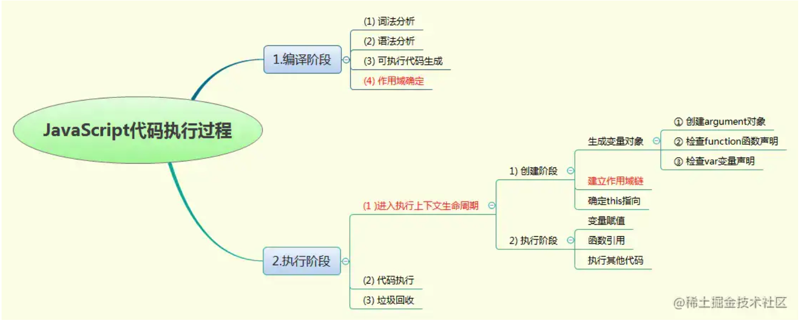

# 什么是闭包？

#### 维基百科中的定义：

> In programming languages, a closure, also lexical closure or function closure, is a technique for implementing lexically scoped name binding in a language with first-class functions. Operationally, a closure is a record storing a function together with an environment. The environment is a mapping associating each free variable of the function (variables that are used locally, but defined in an enclosing scope) with the value or reference to which the name was bound when the closure was created. Unlike a plain function, a closure allows the function to access those captured variables through the closure's copies of their values or references, even when the function is invoked outside their scope.
> 在计算机科学中，闭包（英语：Closure），又称词法闭包（Lexical Closure）或函数闭包（function closures），是在支持头等函数的编程语言中实现词法绑定的一种技术。闭包在实现上是一个结构体，它存储了一个函数（通常是其入口地址）和一个关联的环境（相当于一个符号查找表）。环境里是若干对符号和值的对应关系，它既要包括约束变量（该函数内部绑定的符号），也要包括自由变量（在函数外部定义但在函数内被引用），有些函数也可能没有自由变量。闭包跟函数最大的不同在于，当捕捉闭包的时候，它的自由变量会在捕捉时被确定，这样即便脱离了捕捉时的上下文，它也能照常运行。捕捉时对于值的处理可以是值拷贝，也可以是名称引用，这通常由语言设计者决定，也可能由用户自行指定（如C++）。


#### MDN文档的定义：

> A closure is the combination of a function bundled together (enclosed) with references to its surrounding state (the lexical environment). In other words, a closure gives you access to an outer function’s scope from an inner function. In JavaScript, closures are created every time a function is created, at function creation time.
> 一个函数和对其周围状态（lexical environment，词法环境）的引用捆绑在一起（或者说函数被引用包围），这样的组合就是闭包（closure）。也就是说，闭包让你可以在一个内层函数中访问到其外层函数的作用域。在 JavaScript 中，每当创建一个函数，闭包就会在函数创建的同时被创建出来。


#### 前端红宝书里的定义：

> Closures are functions that have access to variables from another function’s scope. This is often accomplished by creating a function inside a function.
> 闭包指的是那些引用了另一个函数作用域中变量的函数，通常是在嵌套函数中实现的。


#### 小黄书闭包的定义：

> Closure is observed when a function uses variable(s) from outer scope(s) even while running in a scope where those variable(s) wouldn't be accessible.
> 当函数在一些  外部(词法作用域中)变量 无法被访问的 作用域中 访问了该（词法）作用域中的变量，就形成了闭包。


## JavaScript执行

尽管通常将 JavaScript 归类为“动态”或“解释执行”语言，但事实上它是一门编译语言。

为什么有这样的歧义呢？ 因 为与其他语言不同， JavaScript 的编译过程不是发生在构建之前的。对于 JavaScript 来说，大部分情况下编译发生在代码执行前的几微秒（甚至更短！）的时 间内。

JS引擎在运行过程主要分为两大步骤

- 编译期（这个时期 JS引擎会请自己的好基友 `编译器`，来负责语法分析及代码生成等）
- 执行期（这个主要有JS引擎来完成，在这个时期创建了执行上下文等）




### 编译期

编译期主要经历了三个“编译”步骤

1. 分词/词法分析（Tokenizing/Lexing） 这个过程会将由字符组成的字符串分解成（对编程语言来说）有意义的代码块，这些代 码块被称为词法单元（token）。
2. 解析/ 语法分析（Parsing) 将“词法单元流（数组）”转换成一个由元素逐级嵌套所组成的代表了程序语法结构的树。这个树被称为“抽象语法树”（Abstract Syntax Tree，AST） 。
3. 可执行代码生成 将 AST 转换为可执行代码的过程称被称为代码生成。这个过程与语言、目标平台等息 息相关。


### 作用域

> 作用域是负责收集并维护由所有声明的标识符（变量）组成的一系列查询，并实施一套非常严格的规则，确定当前执行的代码对这些标识符的访问权限， 控制着变量和函数的可见性与生命周期.

##### 词法作用域/ 静态作用域

词法作用域（lexical scope）：词法作用域也被称为静态作用域（(static scope）。使用词法作用域定义的函数中遇到既不是形参也不是函数内部定义的局部变量的变量时，去函数定义时的环境中查询。

JS采用的就是词法作用域。

##### 动态作用域

动态作用域（dynamic scope）：动态作用域的函数中遇到既不是形参也不是函数内部定义的局部变量的变量时，到函数调用时的环境中查询。

JS中没有动态作用域，在JS中 `this`的表现却和动态作用域有惊人的相似之处，大家可以用理解`this`的指向来理解动态作用域，如果对动态作用域和`this`都不太理解，请留言，有需要我会专门再写一篇专题。

##### 两者最显著的区别

词法作用域是因为用的environment是定义时环境，只有唯一一个；而动态作用域用的environment是运行时环境，有N个，我们不能确定。

##### 块级作用域

块级作用域：在 ES5 只有全局作用域和函数作用域，没有块级作用域。使用let声明的变量只能在块级作用域里访问，有“暂时性死区”的特性（也就是说声明前不可用）。块作用域由 { } 包括，if语句和for语句里面的{ }也属于块作用域。


### JS的作用域机制

JavaScript 采用词法作用域 (lexical scoping), 也就是静态作用域。 作用域链会保存在函数的内部属性 `[[Scope]]` 上. 内部属性供 JavaScript 引擎使用, 开发者是访问不到这个属性的.

> 注意：JS中会有欺骗词法作用域的方法（ eval 和 with）这些方法在词法分析器处理过后依然可以修改作用域，但是这种机制可能有点难以理解，也不是我们今天要说的重点，有机会我以后写文章再说

### 执行期

执行期主要由JS引擎来执行，主要可以分为以下几个步骤

#### 1. 创建执行上下文

> 执行上下文用以描述代码执行时所处的环境。它定义了代码语句对变量或函数的访问权。在JS中表现为一个关联的内部(variable objects)变量对象。

所有的JS代码都在对应的执行上下文中运行。根据调用位置不同可以分为

- 全局执行上下文
- 函数执行上下文
- eval执行上下文

我们以一个代码中函数的调用来举例子:

在函数被调用之前，函数的执行上下文会被创建，在创建过程主要做了如下几件事：

- 创建内部变量对象
- 创建作用域链。
- 确定 this 指向。

##### 什么是作用域链？

我们先举个例子来理解在JS的作用域链： 我们创建了一个函数A，函数里面又创建了一个函数B，此时就存在三个作用域： `全局作用域、A作用域、B作用域。` 在`全局作用域`包含了`A作用域`，`A作用域`包含了`B作用域`。 当B在查找变量的时候会先从`自身的作用域`区查找，找不到再到上一级`A的作用域`查找，如果还没找到就到`全局作用域`查找，这样就形成了作用域链。

#### 2. 执行代码：执行上下文创建完成后，处于内部的代码会被引擎逐句执行。

在这个过程中主要包括了

- 变量的赋值
- 函数的引用和执行
- ......

#### 3. 垃圾回收

在这里不做过多赘述，我们只需要知道代码执行完后，引擎会根据具体的算法策略自动回收就好。 而引擎的回收策略一般由

- 引用计数
- 标记清除

至此 我们已经把 `JS引擎`的编译和运行过程大致了解了一遍。当然具体的过程远远要比我们上面讲的复杂的多，但是作为一个前端同学，先了解这么多足以，毕竟我们今天重点是`闭包`, 若有兴趣，以后可以读书慢慢深挖。

## 再看什么是闭包

由于知道了什么是`词法作用域`，我们现在才能体会到刚刚的闭包定义的真正含义了。我们来简单的分析一下。拿 MDN文档中的解释来分析

> 一个函数和对其周围状态（**lexical environment，词法环境**）的引用捆绑在一起（或者说函数被引用包围），这样的组合就是**闭包**（**closure**）。也就是说，闭包让你可以在一个内层函数中访问到其外层函数的作用域。在 JavaScript 中，每当创建一个函数，闭包就会在函数创建的同时被创建出来。

现在我们来看看这句话，由于JS采用的是 `词法作用域`，所以其作用域链的引用是在其定义的时候确定下来的，和函数在哪执行关系不大，所以，这个闭包就顺利成章的产生了。所以，`闭包`就是这是`JS`这门语言在由`词法作用域`构建和执行过程中引用现象的总结定义，并没有什么特别的。

## 闭包的使用场景

看到自己写 闭包的作用这个小标题，我笑了。这就好比一个人在写吃饭的作用一样。首先，我们看了上面的前置分析应该了解到`闭包无处不在`， 它就偷偷潜伏在你写的代码里，藏在JS这门语言的骨髓里。 说闭包的好处也基本上是再说JS这门语言的好处；说闭包的使用场景，也等同于在分析JS这门语言的优点和最佳实践。

我对闭包的使用场景做了以下总结。

### 1. 实现柯里化函数、偏函数

首先如果你没听说过什么是`柯里化`、`偏函数`，不要被这些稀奇古怪的名字吓到，这些只是简单的概念而已。

#### 柯里化（currying）

> 将接受n个参数的一个函数转化成接受1个参数的n个函数。

这个直译的名字实在是太不好记了，如果改成`扁平化`，`颗粒化`，我觉得更让人容易理解。

举个例子

```js
const curry = function(fn){
    return function curryFn(...args){
        if(args.length<fn.length){
            return function(...newArgs){
                return curryFn(...args,...newArgs)
            }
        }else{
            return fn(...args)
        }
    }
}

let add = (a,b,c)=>a+b+c
// 柯里化
add = curry(add)

console.log(add(1)(2)(3)) // 输出 6
```

#### 偏函数（Partial function）

> 将接受n个参数的单个函数任意固定a个参数，返回接受剩余n-a个参数的函数。

举个例子

```js
function getPerson(name,age){
  return function (height) {
    return `${name} 今年${age}岁啦，身高${height}cm`;
  }
}

let person = getPerson('Bamboo','18');
person('178');     //"Bamboo 今年18岁啦，身高178cm"
```

柯里化和偏函数本质没什么区别，只是约束不同 能够实现这类操作的核心点在于JS使用静态的词法作用域。


https://juejin.cn/post/7055322482600837133
