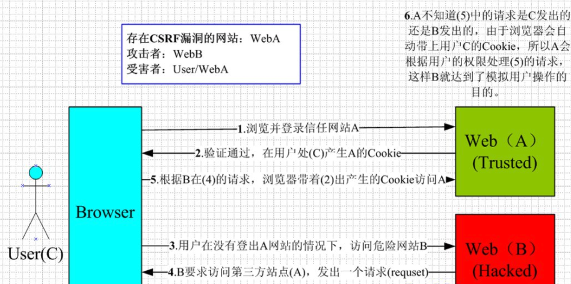

### 一、CSRF是什么？

CSRF（Cross-site request forgery）是一种网络攻击方法，中文名称：跨站请求伪造，也被称为：one click attack/session riding，缩写为：CSRF/XSRF。

### 二、CSRF可以做什么？

攻击者利用用户已经认证的身份在第三方站点上进行恶意操作。攻击者诱使用户访问一个包含恶意请求的网页，当用户浏览该网页时，该请求会利用用户在目标网站上的认证信息（如Cookies）来伪装用户进行操作。例如：以你名义发送邮件，发消息，盗取你的账号，甚至于购买商品，虚拟货币转账…造成的问题包括：个人隐私泄露以及财产安全。

例如，我在自己的文章里放一段代码，接口假设是关注的GET接口

```html

```

那么如果你登录了这个平台，访问这篇文章就会自动关注我。

### 三、CSRF漏洞现状

CSRF这种攻击方式早在2000年就被国外的安全人员提出。然而，在国内直到2006年才开始引起关注。在2008年，国内外多个大型社区和互动网站相继曝出了CSRF漏洞，其中包括纽约时报（[NYTimes.com](http://nytimes.com/)）、Metafilter（一个大型的博客网站）、YouTube和百度HI等。尽管如此，现在仍有许多网站对CSRF攻击没有足够的防范措施，这也导致安全领域将CSRF称为“沉睡的巨人”。

### 四、CSRF的原理



CSRF攻击的实施通常需要受害者依次完成下面两个步骤：

- 登录受信任网站A，并在本地生成Cookie

- 在不登出A的情况下，访问危险网站B

看到这里，你也许会说：“如果我不满足以上两个条件中的一个，我就不会受到CSRF的攻击”。是的，确实如此，但你不能保证以下情况不会发生：

- 你可能登录一个网站后，在另一个标签页中继续访问其他网站。
- 关闭浏览器并不会立即使本地的Cookie过期，你的上次会话可能仍然有效。尽管实际上关闭浏览器并不等同于退出登录/结束会话，但大多数人错误地认为关闭浏览器就代表退出登录/结束会话了。
- 攻击网站可能是一个存在其他漏洞的受信任网站，这使得攻击更具欺骗性


### 五、解决CSRF攻击

1. 验证HTTP Referer字段：服务器可以验证请求的HTTP头部“Referer”字段，以确认请求是否来自于信任的域名。
2. 使用Anti-CSRF Token：服务器生成一个唯一的token，并在客户端的会话中存储这个token。每一次用户提交请求时都需要携带这个token，服务器接收到请求后验证token的有效性。
3. 双重Cookies验证：服务器检查请求中的自定义Cookies字段，与请求本身携带的Cookies进行对比，如果不匹配，则拒绝请求。
4. 自定义请求头：利用浏览器的同源策略，普通网站无法读取或设置自定义的HTTP请求头，因此可以要求所有敏感操作必须通过含有自定义请求头的Ajax请求提交。
5. 利用SameSite Cookie属性：设置Cookies的SameSite属性，可以限制Cookies不随跨站请求发送，减少CSRF攻击的风险。
