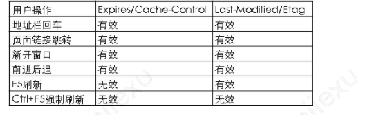

### http缓存

header里缓存相关的属性

- Expires

```
响应头,代表该资源的过期时间，在http1.0引入
```

- Cache-control

```
请求/响应头，可以配置缓存策略，在http1.1引入，与Expires同时存在时，优先使用Cache-control
```

- If-Modified-Since

```
请求头，资源最近修改时候，浏览器通过request header传给服务器
```

- Last-Modified

```
响应头，资源最近修改时间，服务器通过response header传给浏览器
```

- Etag

```
响应头，资源标识，服务器通过response header传给浏览器
```

- If-None-Match

```
请求头，缓存的资源标识，浏览器通过request header传给服务器
```

### 原始模式

浏览器请求服务器资源（1KB），服务器读取本地资源（10KB）,服务器返回资源给浏览器（1KB）

总共12KB

请求n次，花费12nKB

### 缓存模式

浏览器请求服务器资源（1KB），服务器读取本地资源（10KB）,服务器返回资源给浏览器（1KB）

总共12KB

浏览器再次请求会读取浏览器缓存，不需要给服务器发送请求

请求n次，花费12KB

### http1.0缓存

##### 约定过期时间Expires

格式Fri, 01 Jan 2021 00:00:00 GMT，第一次请求资源返回后，浏览器会缓存服务器返回的Expires，下次请求未超过Expires的时间就直接读取浏览器的缓存，不需要向服务器发送请求，如果Expires过期了，就发起新的请求，并返回新的Expires存起来，不断循环，这个又称强缓存。

##### 文件最后修改时间Last-Modified

未保证文件尽量是最新的，缓存时间一般不会太长，但是又不排除资源会很长时间才更新，因此引入资源的Last-Modified。

在第一次请求拉取资源后，浏览器会存下每个资源请求响应的Last-Modified字段，在Expires过期后，浏览器发起请求重新拉取的资源，此时请求header会带上资源最新修改时间作为If-Modifies-Since属性的值，如果发现拉取资源的Last-Modified和If-Modifies-Since一样，便不再读取资源，让浏览器继续读缓存，又称协商缓存。

缺点：

- Expires 过期控制不稳定，因为浏览器端可以随意修改时间，导致缓存使用不精准。
- Last-Modified 过期时间只能精确到秒。

### http1.1缓存

**引入cache-control**

 Cache-Control：max-age=10    代表意思是在10秒以内，使用缓存到浏览器的 a.js 资源。
浏览器先检查 Cache-Control，如果有，则以 Cache-Control 为准，忽略 Expires。如果没有 Cache-Control，则以 Expires 为准。

**引入Etag**

为了解决文件修改时间只能精确到秒带来的问题，和文件内容没修改，但是文件最近修改时间修改了的问题。引入了Etag 文件内容的唯一标识ID。浏览器会存下Etag为了header的If-None-Match的值传给服务器核对内容是否又修改，修改了才重新拉取资源。

### 主动拉起更新的资源

服务器在缓存时间期间更新了数据，浏览器就没办法主动拉取最新的资源。

如果每次把更新的资源的名字也同时修改，在浏览器端就会对没缓存过的资源名进行资源拉取，从而实现浏览器主动拉取服务器更新的资源，一般webpack会默认在打包的时间，在文件名后加上hash值，每次更新的文件就改变其hash值，实现新资源能及时拉取。 


### **http header中与缓存有关的key**

|        key        |              描述               | 存储策略 | 过期策略 | 协商策略 |
| :---------------: | :-----------------------------: | :------: | :------: | :------: |
| **Cache-Control** |   指定缓存机制，覆盖其它设置    |    ✔️     |    ✔️     |          |
|    **Pragma**     |    http1.0字段，指定缓存机制    |    ✔️     |          |          |
|    **Expires**    | http1.0字段，指定缓存的过期时间 |          |    ✔️     |          |
| **Last-Modified** |     资源最后一次的修改时间      |          |          |    ✔️     |
|     **ETag**      |    唯一标识请求资源的字符串     |          |          |    ✔️     |

### Cache-Control

浏览器缓存里， Cache-Control是金字塔顶尖的规则， 它藐视一切其他设置， 只要其他设置与其抵触， 一律覆盖之.

不仅如此， 它还是一个复合规则， 包含多种值， 横跨 **存储策略**， **过期策略** 两种， 同时在请求头和响应头都可设置.

语法为: *“Cache-Control : cache-directive”*.

Cache-directive共有如下12种(其中请求中指令7种， 响应中指令9种):

|                Cache-directive                 |                             描述                             | 存储策略 | 过期策略 | 请求字段 | 响应字段 |
| :--------------------------------------------: | :----------------------------------------------------------: | :------: | :------: | :------: | :------: |
|                   **public**                   |                资源将被客户端和代理服务器缓存                |    ✔️     |          |          |    ✔️     |
|                  **private**                   |            资源仅被客户端缓存， 代理服务器不缓存             |    ✔️     |          |          |    ✔️     |
|                  **no-store**                  |                      请求和响应都不缓存                      |    ✔️     |          |    ✔️     |    ✔️     |
|                  **no-cache**                  | 相当于`max-age:0，must-revalidate`即资源被缓存， 但是缓存立刻过期， 同时下次访问时强制验证资源有效性 |    ✔️     |    ✔️     |    ✔️     |    ✔️     |
|                  **max-age**                   |        缓存资源， 但是在指定时间(单位为秒)后缓存过期         |    ✔️     |    ✔️     |    ✔️     |    ✔️     |
|                  **s-maxage**                  | 同上， 依赖public设置， 覆盖max-age， 且只在代理服务器上有效. |    ✔️     |    ✔️     |          |    ✔️     |
|                 **max-stale**                  |           指定时间内， 即使缓存过时， 资源依然有效           |          |    ✔️     |    ✔️     |          |
|           **stale-while-revalidate**           | 允许你使用缓存的内容尽快响应请求（如果可用），如果未缓存，则回退到网络请求。 然后，网络请求用于更新缓存。 |    ✔️     |    ✔️     |          |    ✔️     |
|                 **min-fresh**                  |             缓存的资源至少要保持指定时间的新鲜期             |          |    ✔️     |    ✔️     |          |
| **must-revalidation** / **proxy-revalidation** | 如果缓存失效， 强制重新向服务器(或代理)发起验证(因为max-stale等字段可能改变缓存的失效时间) |          |    ✔️     |          |    ✔️     |
|               **only-if-cached**               |   仅仅返回已经缓存的资源， 不访问网络， 若无缓存则返回504    |          |          |    ✔️     |          |
|                **no-transform**                | 强制要求代理服务器不要对资源进行转换， 禁止代理服务器对 `Content-Encoding`， `Content-Range`， `Content-Type`字段的修改(因此代理的gzip压缩将不被允许) |          |          |    ✔️     |    ✔️     |

### 用户操作行为与缓存

用户在使用浏览器的时候，会有各种操作，比如输入地址后回车，按F5刷新等，这些行为会对缓存有什么影响呢？



