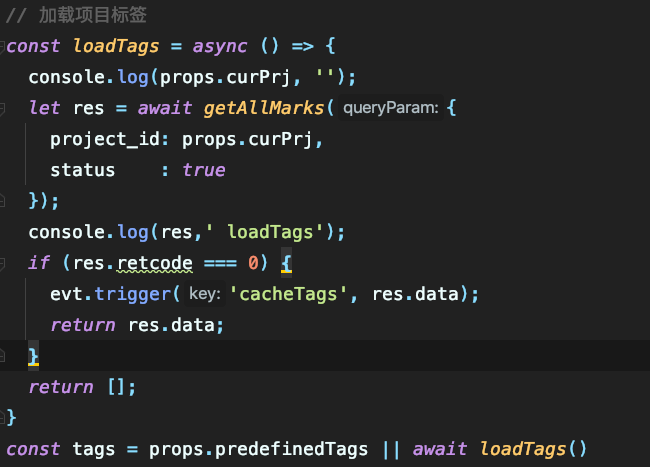

vue setup 不能直接在最外面写await请求，需要写在钩子函数中

顶层await

`async setup()` 必须与 `Suspense` 组合使用，`Suspense` 目前还是处于实验阶段的特性。我们打算在将来的某个发布版本中开发完成并提供文档 - 如果你现在感兴趣，可以参照 [tests](https://github.com/vuejs/vue-next/blob/master/packages/runtime-core/__tests__/components/Suspense.spec.ts) 看它是如何工作的。
