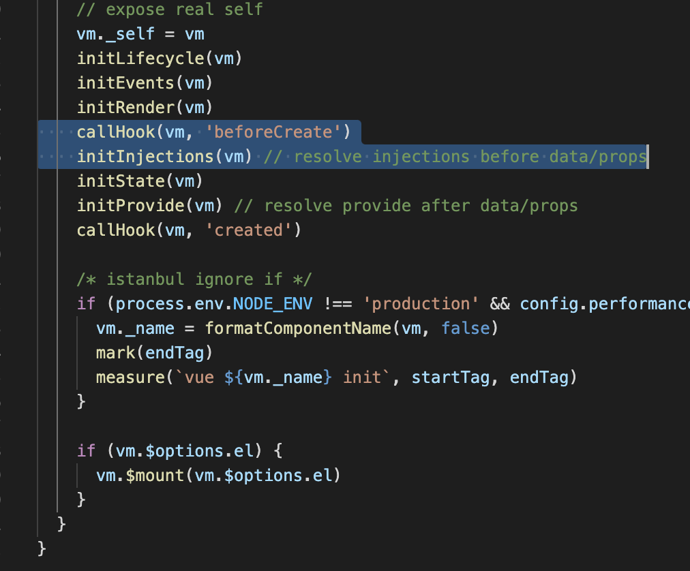
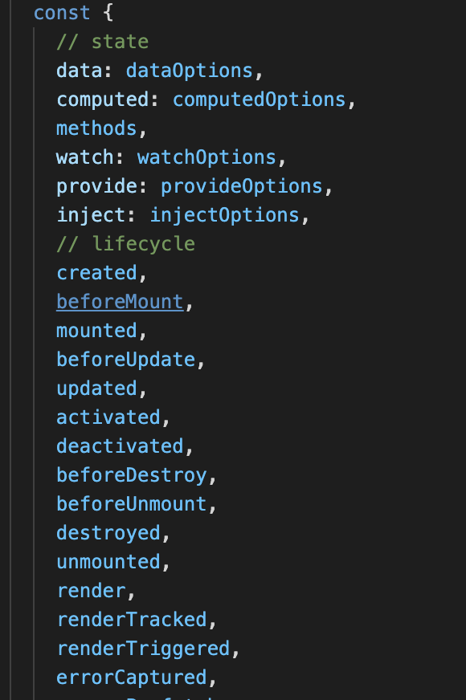

# **简述 Vue 的生命周期以及每个阶段做的事**

1、概念：vue实例被创建的过程中会经过一系列的初始化步骤，比如数据观测、模版编译、挂载实例到dom，以及数据变化时更新dom，可以提供用户自定义代码在期间某些阶段执行的回调函数就是生命周期钩子函数。

2、创建前后、载入前后、更新前后、销毁前后

| 生命周期v2    | 生命周期v3        | 描述                       |
| :------------ | :---------------- | :------------------------- |
| beforeCreate  | beforeCreate      | 组件实例被创建之初         |
| created       | created           | 组件实例已经完全创建       |
| beforeMount   | beforeMount       | 组件挂载之前               |
| mounted       | mounted           | 组件挂载到实例上去之后     |
| beforeUpdate  | beforeUpdate      | 组件数据发生变化，更新之前 |
| updated       | updated           | 数据数据更新之后           |
| beforeDestroy | **beforeUnmount** | 组件实例销毁之前           |
| destroyed     | **unmounted**     | 组件实例销毁之后           |

| 生命周期v2    | 生命周期v3          | 描述                                     |
| :------------ | :------------------ | :--------------------------------------- |
| activated     | activated           | keep-alive 缓存的组件激活时              |
| deactivated   | deactivated         | keep-alive 缓存的组件停用时调用          |
| errorCaptured | errorCaptured       | 捕获一个来自子孙组件的错误时被调用       |
| -             | **renderTracked**   | 调试钩子，响应式依赖被收集时调用         |
| -             | **renderTriggered** | 调试钩子，响应式依赖被触发时调用         |
| -             | **serverPrefetch**  | ssr only，组件实例在服务器上被渲染前调用 |

3、结合实践：

**beforeCreate**：通常用于插件开发中执行一些初始化任务，$store

**created**：组件初始化完毕，可以访问各种数据，获取接口数据等

**mounted**：dom已创建，可用于获取访问数据和dom元素；访问子组件等。

**beforeUpdate**：此时`view`层还未更新，可用于获取更新前各种状态

**updated**：完成`view`层的更新，更新后，所有状态已是最新

**beforeunmount**：实例被销毁前调用，可用于一些定时器或订阅的取消

**unmounted**：销毁一个实例。可清理它与其它实例的连接，解绑它的全部指令及事件监听器

### 可能的追问

1. setup和created谁先执行？
2. setup中为什么没有beforeCreate和created？

v2

V3

