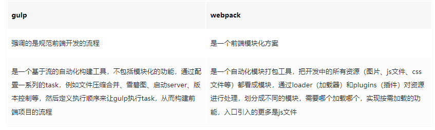

### 前言

在`vue`、`react`出现以后，`gulp`渐渐淡出了做业务前端人员的视野，14到16年曾是`gulp`最巅峰的时期，取代了当时最火的`grunt` ，当时`webpack`在`gulp`中还有一个插件（`gulp-webpack`）作为使其可以作为`gulp`️一个子任务来执行，直到`vue`，`react`等`spa`项目出现，才让`webpack`取而代之，`gulp`也逐渐退出幕前，转战幕后，去做了它更擅长的事情：**前端开发流程规范管理**。


### gulp和webpack




### 核心api

- task: 创建一个任务
- series：顺序执行多个任务
- prallel：并行执行多个任务
- src：读取数据源转换成stream
- pipe：管道-可以在中间对数据流进行处理
- dest：输出数据流到目标路径
- on：事件监听
- watch：数据源监听


### 增量编译

```
const since = task => file =>
  gulp.lastRun(task) > file.stat.ctime ? gulp.lastRun(task) : 0;

const ts = () => gulp.src(
    'src/**/*.ts',
    { since: since(ts) }
)
```

