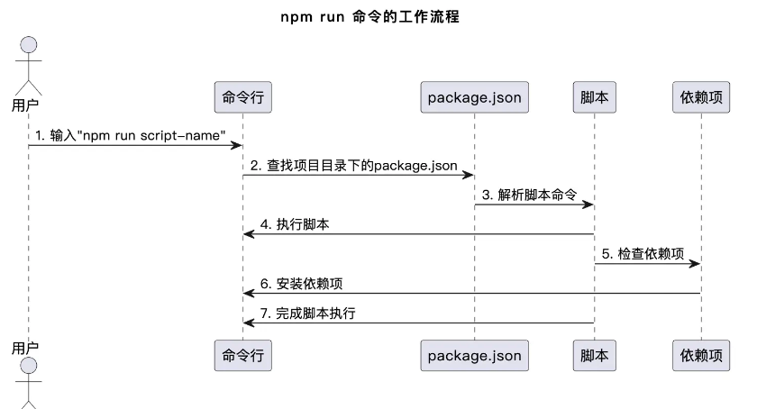

##  npm 和 package.json

##### npm

Node Package Manager（npm）是 JavaScript 生态系统的包管理工具，允许开发人员安装、发布和管理各种 JavaScript 包。它是 Node.js 的一部分，为了协同开发和依赖管理而诞生。

"npm run"用于执行各种脚本任务，例如启动开发服务器、运行测试套件或自定义构建过程。

##### package.json

每个 Node.js 项目都伴随着一个 package.json 文件，这是项目的核心配置文件。它包含了项目的元数据（如名称、版本、作者等）以及最重要的部分——"scripts"，其中定义了可通过 "npm run" 命令执行的脚本。

## npm run 命令的作用

##### 执行一个脚本

```
npm run script-name
```

这将触发名为 "script-name" 的脚本的执行。


##### 运行自定义脚本

开发者可以在 package.json 文件的 "scripts" 部分定义自己的脚本。

```
"scripts": {
    "dev": "cross-env NODE_ENV=DEVELOPMENT gulp --release=002",
}
// cross-env用于不同环境的变量设置,process.env.NODE_ENV为DEVELOPMENT
// --release=002向npm脚本传入参数，通过process.argv.slice(2)
```


##### 工作流程




## 自定义脚本的高级用法

npm 脚本的原理非常简单。每当执行npm run，就会自动新建一个 Shell，在这个 Shell 里面执行指定的脚本命令。因此，只要是 Shell（一般是 Bash）可以运行的命令，就可以写在 npm 脚本里面。

##### **传递参数给脚本**

```
npm run my-script -- arg1 arg2
```

向 npm 脚本传入参数，要使用--标明。

**使用环境变量**

```
{
  "scripts": {
    "my-script": "NODE_ENV=production node my-script.js"
  }
}
```

**串联多个脚本**

```
{
  "scripts": {
    "build": "npm run clean && npm run compile && npm run minify"
  }
}
```

**npm 脚本钩子**

```
{
  "scripts": {
    "prebuild": "npm run lint",
    "build": "webpack"
  }
}
```

这里，“prebuild”脚本将在“build”脚本之前运行，可以用于在构建之前执行代码检查或其他操作。

**使用外部工具和插件**

```
{
  "scripts": {
    "build": "glup"
  }
}
```

你还可以在脚本中使用外部工具和插件，例如 Grunt、Gulp 或 Webpack，以执行更复杂的任务。